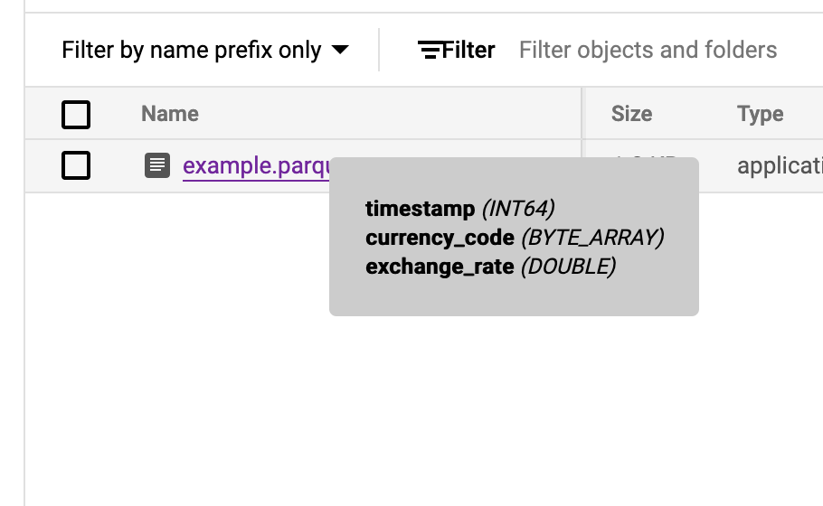

# Parquet info firefox extension
Playground demo of a firefox extension that shows parquet file info when hovering over a link to a parquet file in GCP cloud storage.
This is leverage DuckDB WASM.

## How to run your firefox extension
Start [here](https://developer.mozilla.org/en-US/docs/Mozilla/Add-ons/WebExtensions/Your_first_WebExtension).
When opening Firefox, go to `about:debugging` and load the extension as a temporary extension. Click on any file of your extension (typically `manifest.json`) to load it.
Once the extension is loaded, you can click "inspect" to have a window with the console open where you can easily reload the extension.

## Folder Structure
* manifest.json: The manifest file that describes the extension, including its name, version, and permissions it requires.
* content_script/main.js: the panel that shows the parquet file info
* panel/panel.js: where DuckDB wasm is loaded and used to query the parquet file

## Screenshot

